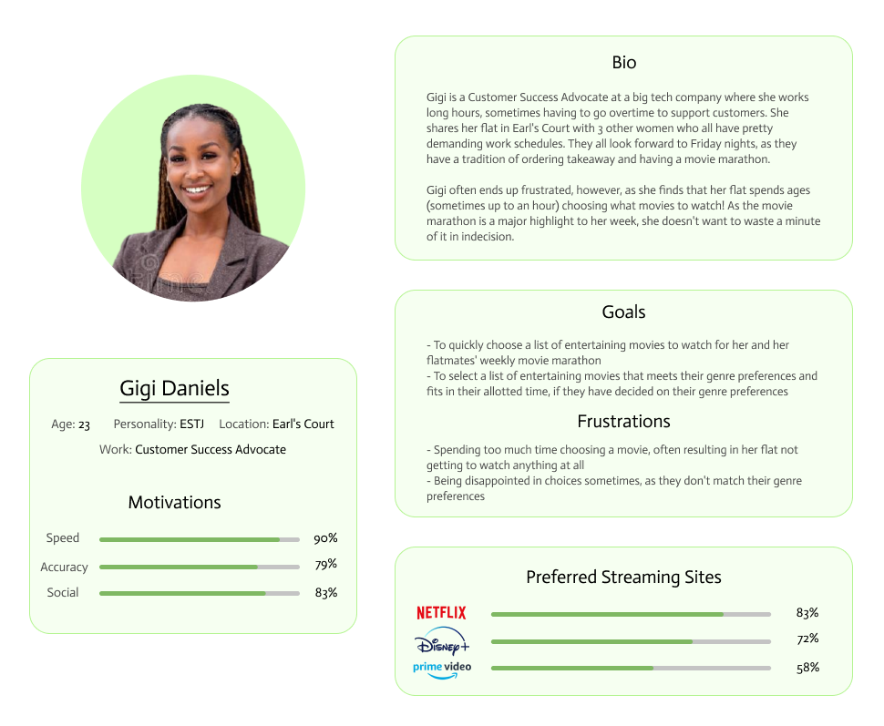
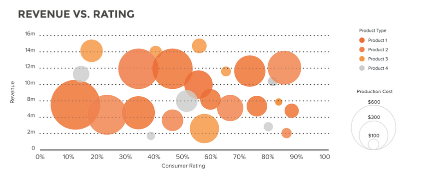
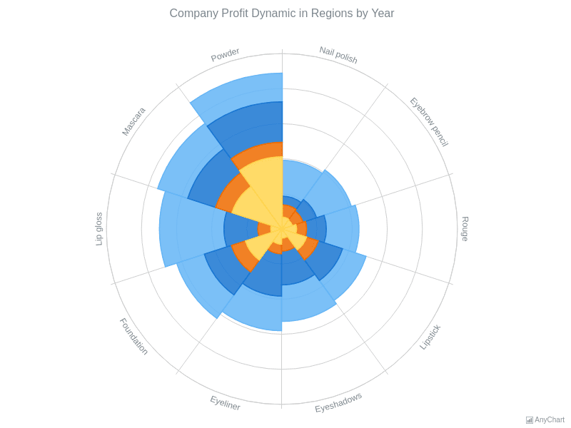
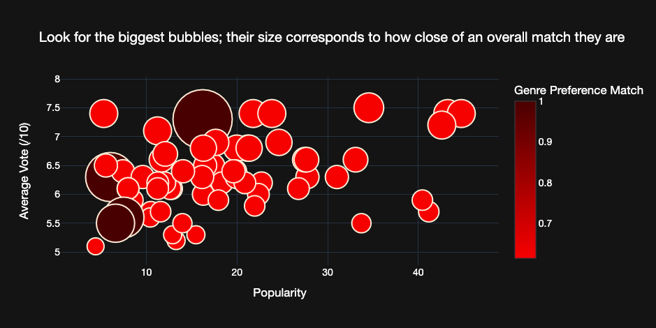
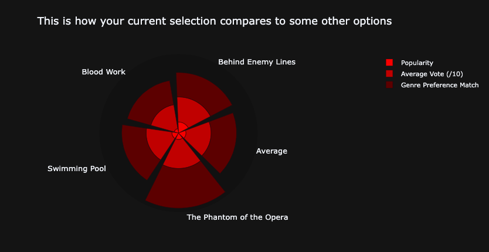
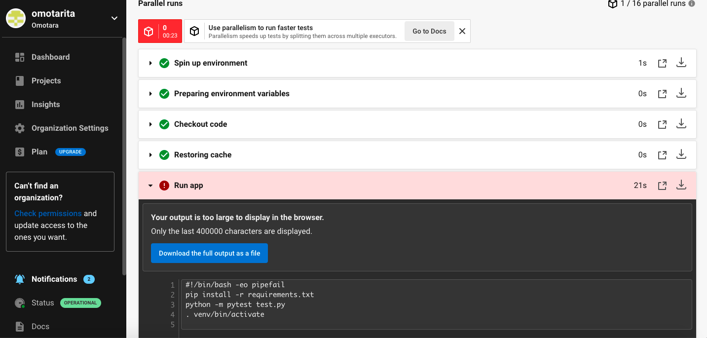

# Coursework 1 

### Repository URL
[Coursework Repository](https://github.com/omotarita/comp0034-cw1)

### Set-Up Information
All dependencies in requirements.txt should be installed in order to run the code in this repository. Use the command 'pip install ...' at Terminal to do so.

## Purpose and Target Audience

My app, NetPix, intends to offer a solution to streaming site users who suffer from “decision fatigue”: that is a phenomenon describing users’ struggle to choose, which is exacerbated by having more options they have to choose from. What’s the point in having thousands of content options on sites like Netflix and Amazon Prime if that makes it even harder to choose one?

The app is intended for use in tandem with Netflix, although we intend to expand its scope to other streaming platforms assuming it’s successful within the market. It’s targeted at young adults between the ages of 18 and 24 (as this demographic makes up 89% of the overall Netflix user base, according to a 2015 survey) and aims to create effective visualisations which empower users to make more informed and accurate choices on what to stream. 

The following user persona exemplifies the target audience and potential use cases of NetPix:

To address the “decision fatigue” issues widely posed by streaming platforms, NetPix will act as a recommender engine which takes the input of a user’s genre preferences and the maximum amount of time they have to spend watching Netflix and returns a couple of visualisations on the viewing stats for different movies that match these. 

Thus, by going one step further than what’s currently offered on streaming platforms, in allowing for more than one genre preference and maximum time to be taken into consideration, and providing users with statistics on other viewers’ ratings of the movies that match these (such as popularity and average vote), NetPix will help take out some of the guesswork and misdirection involved in users’ decision-making. 

For the app to achieve its intended purposes as described, the visualisations created therein aim to address the following questions:

1. *What are the most popular/highest scoring movies that match a user’s given preferences (their preferred genres and/or the maximum length of time they have to spend watching)?*
2. *How many of these movies can fit into a user’s allotted movie-watching time?*
3. *Is there a correlation between a movie’s popularity and the vote (or rating) awarded to it by viewers?*
4. *How do the popularity and the average score for a user’s chosen movie compare to that of alternative matching movies and the overall average for its genre? (In the case of only one movie being chosen)*
5. *How do the average popularity and the average score for a user’s chosen set of movies compare to these statistics for alternative sets of movies? (In the case of multiple movies being chosen)*

## Visualisation Design

### 1. Results (Bubble Chart)

Upon confirming their preferences, users will be navigated to a screen displaying a list of movies that correspond to these and a data visualisation providing further insight into the statistics for each of these movies (namely their popularity, the average vote awarded to them by viewers and their adherence to the user’s genre preferences). This visualisation aims to support users in making an informed decision on what movie (or combination of movies) to watch and which ones not to watch.

I suggest displaying this information in a bubble chart (similar to the one shown above) but instead with the x-axis corresponding to the movie’s average score, the y-axis corresponding to the movie’s popularity and the bubble size corresponding to genre preference adherence (a standardised score relating to how closely the movie’s genres match the user’s genre preferences). The bubbles themselves won’t display any directly identifying characteristics of the movies aside from the number corresponding to its position in the list of results, so as not to overwhelm the visualisation. However, upon hovering over each bubble, more information will be displayed, such as the movie’s title, its cover image, tagline and specific statistics. 

The questions this visualisation intends to answer are:

1. *What are the most popular/highest scoring movies that match a user’s given preferences (their preferred genres and/or the maximum length of time they have to spend watching)?*
2. *How many of these movies can fit into a user’s allotted movie-watching time?*
3. *Is there a correlation between a movie’s popularity and the vote (or rating) awarded to it by viewers?*

The advantage of using a bubble chart over other types of data visualisation is its ability to consolidate multiple (up to four) dimensions of data in a visual format, thus facilitating interpretation beyond what is achievable by most other visualisations. Given our target demographic consists of young adults who use streaming platforms and our overarching aim is to reduce “decision fatigue”, it emerges as not only appropriate, but necessary to choose a visualisation which makes it easy for users to compare a large amount of data without having to give it much thought. 

Furthermore, given our target audience (young adults) and their purpose for using this visualisation (maximising their entertainment and minimising the time it takes to achieve this), one can assume that they'll be more concerned with quickly observing patterns than crunching numbers. As such, a key aim for both this visualisation and the subsequent one is to communicate the entertainment prospects of each movie as clearly as possible.

### 2. User Selection Statistics (Wind Rose/Stacked Polar Bar Chart)

Finally, on confirming their selection of movie/s, users are navigated to a page displaying the same movie information shown upon hovering over the bubble chart, such as the title/s and cover image/s and, additionally, a brief description of the/each movie and a data visualisation providing a clearer gauge on how their selection compares to other options. The purpose of this visualisation is to guide users’ decision-making further, by showing a more “zoomed-in” view of the data for a small number of movies/movie combinations, whilst highlighting the user’s selected movie/s to support comparison across these options and, subsequently, facilitate the validation of their final, confirmed choice.

I suggest visualising this as a stacked polar bar chart (similar to the one shown above),  featuring a clearly highlighted bar corresponding to the user’s selection/s, a bar corresponding to the data average for all the movies matching the user’s preferences and the remaining bars corresponding to up to three alternative recommended movies (or sets of movies) matching the user’s preferences. The stacked segments should correspond to the movies’ popularity, average vote awarded and genre-adherence and each of these parameters can be deselected to remove them from being viewed in the visualisation. 

The questions this visualisation intends to answer are:

1. *How do the popularity and the average score for a user’s chosen movie compare to that of alternative matching movies and the overall average for its genre? (In the case of only one movie being chosen)*
2. *How do the average popularity and the average score for a user’s chosen set of movies compare to these statistics for alternative sets of movies? (In the case of multiple movies being chosen)*

The use of a stacked polar bar chart combines the key advantages of stacked bar charts (being able to easily compare different dimensions of data, as well as the aggregation of these, for a number of different variables) and that of polar bar charts (the visual benefits, such as being able to more easily distinguish slight differences in bar lengths). Again, simple and effective data visualisations are essential if this app intends to make a significant impact to the “decision fatigue” experienced by our target demographic, a consumer group often distinguished by their notably short attention spans. 

### Visual Styles

Both data visualisations, as well as the entire app, will feature styling consistent with that of Netflix, to maintain uniformity and visual association with the popular streaming platform.

## Visualisation Evaluation

### 1. Results (Bubble Chart)

  
Target questions.

 
1. *What are the most popular/highest scoring movies that match a user’s given preferences (their preferred genres and/or the maximum length of time they have to spend watching)?*
2. *How many of these movies can fit into a user’s allotted movie-watching time?*
3. *Is there a correlation between a movie’s popularity and the vote (or rating) awarded to it by viewers?*
 
 

It was difficult to maintain clarity with this visualisation as, due to the vastness of the dataset from which it's created, it tended towards becoming quite cluttered and data points became relatively indiscernible. I aimed to remedy this by restricting the number of movies visualised to a user's top 20 results, however this made it worse, as the results ended up becoming heavily clustered.

Ultimately I implemented some code which restricted the number of movies visualised to a random sample of 20% of the movies that matched user's preferences; this ensured variation between the results (thus facilitating clearer cross-comparison).

I believe the final visualisation was successful at answering the questions listed. As you can see in the example image provided above, bubbles of different sizes can be clearly distinguished, thus effectively indicating the best matching movies. As the match score awarded to a movie is dependent on its genre match adherence, the colourscale to the right of the visualisation also helps facilitate its effectiveness at conveying a user's best matches. Additionally, the colourscale corresponds to Netflix's own brand palette, which should help captivate our target audience.

By plotting points against their popularity and average scores, one can distinctly recognise the most popular/highest scoring movies given their preferences. However, as shown in the image above, these parameters don't always indicate how close of a match a movie will be. Furthermore, there appears to be minimal correlation between movies' popularity and their vote, thus answering the third target question.

The visualisation would be improved by being shown in a larger format, as this would help space data points out and reduce some of the apparent clustering observed. However, this wasn't possible in this case, due to the spatial constraints of the dashboard.

### 2. Results (Wind Rose/Polar Chart)

  
Target questions.

 
1. *How do the popularity and the average score for a user’s chosen movie compare to that of alternative matching movies and the overall average for its genre? (In the case of only one movie being chosen)*
2. *How do the average popularity and the average score for a user’s chosen set of movies compare to these statistics for alternative sets of movies? (In the case of multiple movies being chosen)*
 
 

I wasn't able to implement functionality to allow for the selection of multiple movies; as such, the second target question was not answered. 

The polar chart visualisation is effective at conveying differences between a user's selected movie and alternative options, although this varies depending on how good of a match the selected movie is (the worse the match, the clearer the differences between it and the alternative options). 

Nonetheless, the polar charts rendered by the NetPix app stand out more than anticipated, likely due to my hiding of the radial and angular gridlines which I didn't initially think would be possible, and the contrast between its colour scheme and the dark dashboard background. 

See below an example of one of these visualisations.

## Project Management

Given my unfamiliarity with Plotly and Dash prior to starting this project, it was difficult to ascertain how much time I would need for each task; which made sprint planning impossible, as it requires the assignment of deadlines. Thus, I decided instead to opt to use the Kanban Agile strategy to plan out the tasks I needed to undertake for this project and manage my delivery of these.

I started by fractionating my project into a few broad categories of tasks, namely "Visualisations", "Interactivity", "Styling", "Testing", before disambiguating these by breaking them down further. Eventually I arrived at a long set of minor, doable tasks for each category. Using some in-built Kanban software on my laptop, I created three areas: "Backlog", "In Progress" and "Done", and placed all the tasks in "Backlog". I began each working session by working through the tasks under "In Progress" (which were usually moved there at the end of the previous session, and decided upon based on my progress and the wider category of task they fell under; I tried to complete each category sequentially).

## Continuous Integration

  
See here the results of a build attempt using CircleCI.

 

 
 

## Bibliography

aigamer28100. (2018). *Movie Lens Dataset Visualization and Prediction* [online]. Available from: [GitHub](https://aigamer28100.github.io/Movie-Lens-Dataset-Visualization-and-Prediction/). [accessed 13 February 2022]

Chen, L. (2019). *Learning about Media Users from Movie Rating Data* [online]. Available from: [DSpace@MIT](https://dspace.mit.edu/bitstream/handle/1721.1/129200/1227275102-MIT.pdf?sequence=1&isAllowed=y). [accessed 16 February 2022]

Das, A. (2020). *Nightingale Rose Plots in Python using Plotly.* [online]. Available from: [Medium](https://medium.com/@abhishekdas.nitc/nightingale-plots-in-python-using-plotly-da42bc18d15d). [accessed 23 February 2022]

Das, S. (2020). *Create Your Own Movie Movie Recommendation System* [online]. Available from: . [acccessed 6 February 2022]

Heberer, R. (2020). *Improving Plotly's Polar Bar Charts* [online]. Available from: [Medium | Towards Data Science](https://towardsdatascience.com/improving-plotlys-polar-bar-charts-43f6eec867b7). [accessed 23 February 2022]

Netflix. (2022). *How to rate TV shows and movies* [online]. Available from: [Netflix Help Center](https://help.netflix.com/en/node/9898). [accessed 15 February 2022]

Varun. (2022). *Data visualization, the key to Netflix’s success: an analysis* [online]. Available from: [Toucan Toco](https://www.toucantoco.com/en/blog/data-visualization-the-key-to-netflixs-success-an-analysis). [accessed 10 February 2022]

Webga, K & Lu, A. (2015). *Personal Movie Recommendation Visualization from Rating Streams* [online]. Available from [UNC Charlotte](https://webpages.charlotte.edu/alu1/papers/movie15.pdf). [accessed 12 February 2022]

## Notes

I have included in the [pages](pages) directory, a number of files in which I wrote code that contributed to my final Dash app, for reference purposes. Please note that none of these files in the [pages](pages) directory are my final Dash app submission. 

My final Dash app is [netpix.py](netpix.py).